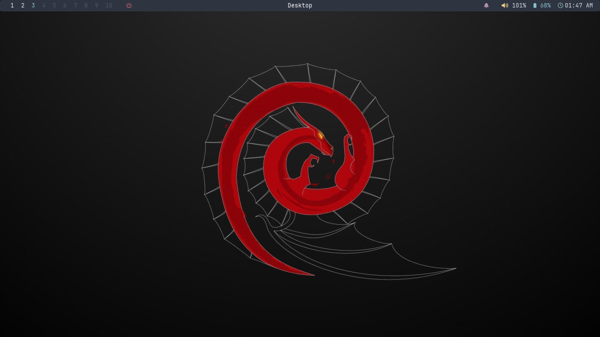
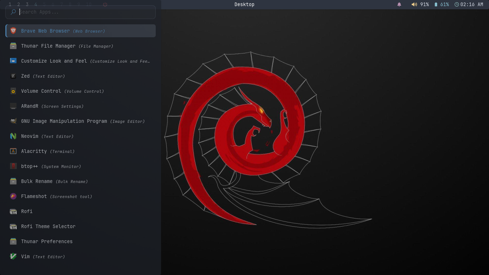
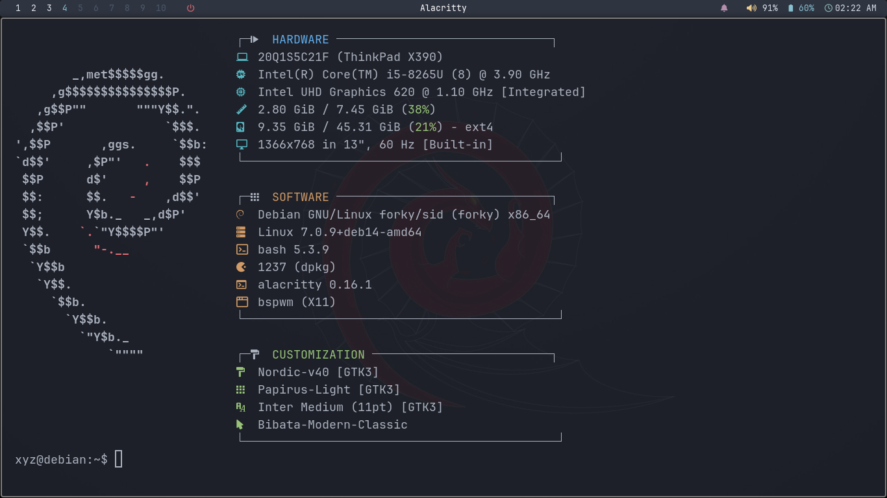
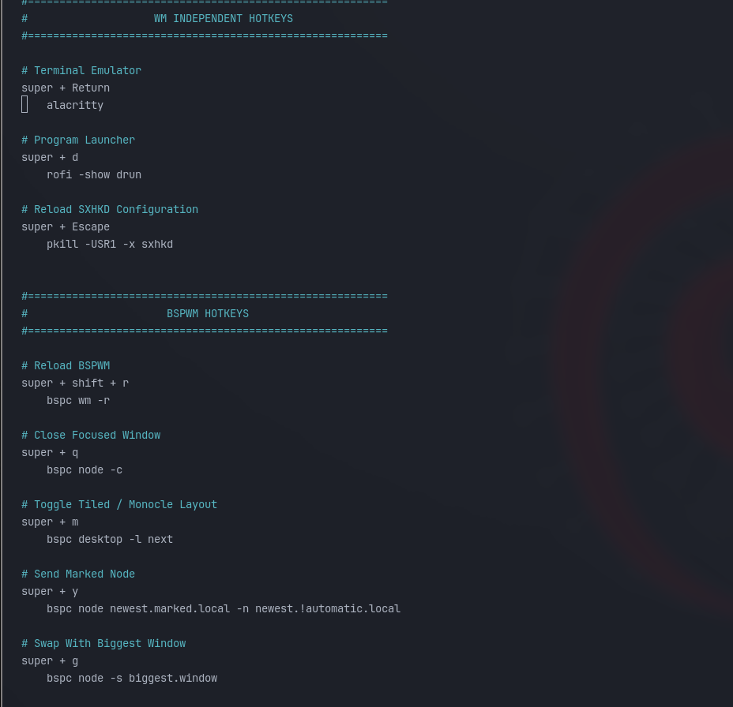
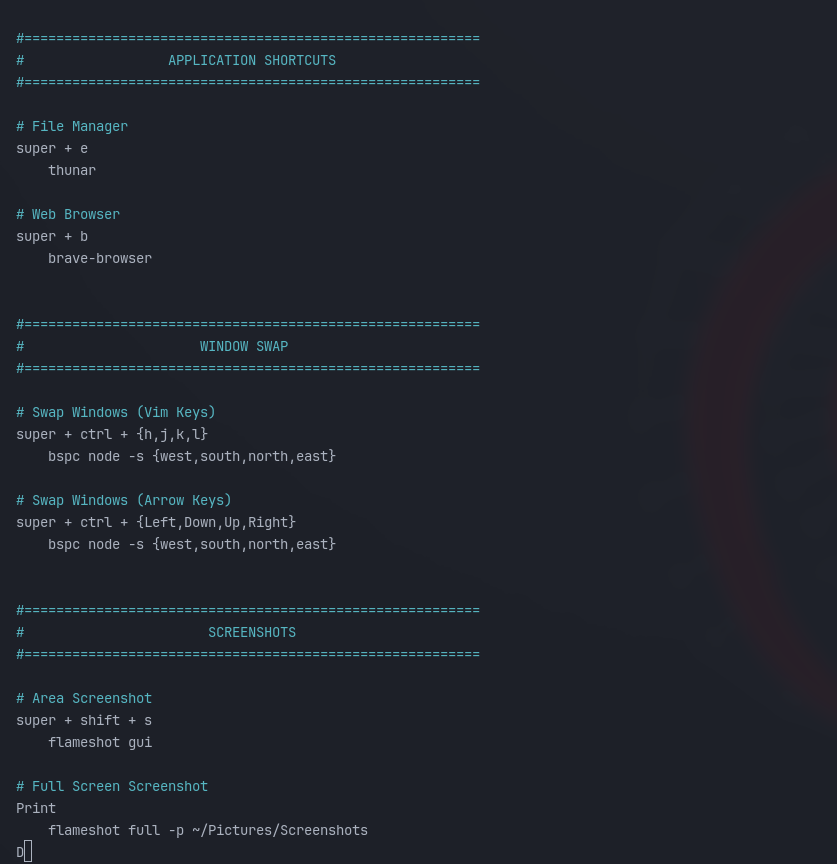
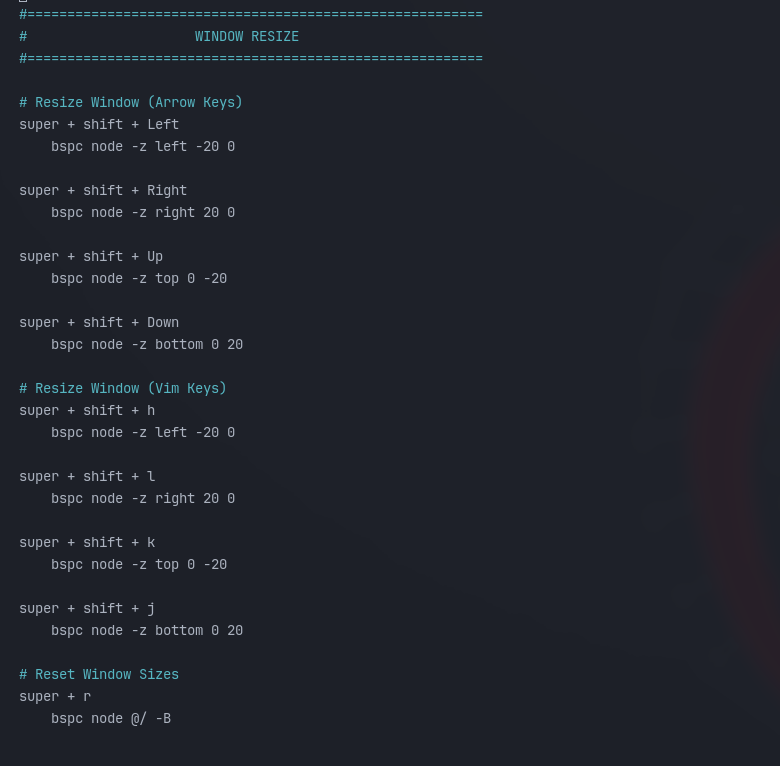

---
# 🚀 Debian BSPWM Setup
A fast, lightweight, and modern **Debian desktop environment** powered by **BSPWM**.
---
A fully automated installation script to deploy a clean, fast, and keyboard-driven BSPWM (Binary Space Partitioning Window Manager) environment on Debian/Ubuntu systems.

## ✨ Features
* Interactive installer
* Fully automated setup
* BSPWM tiling window manager
* SXHKD keyboard shortcuts

### 🎨 Appearance

* Polybar status bar
* Rofi application launcher
* Picom compositor
* JetBrainsMono & FiraCode Nerd Fonts

### ⚙️ Software Selection

| Category        | Options                            |
| --------------- | ---------------------------------- |
>| 🖥️ Terminal    | Alacritty • Kitty                  |

>| 📁 File Manager | Thunar • Dolphin • Nautilus        |

>| 🌐 Browser      | Firefox • Brave • Thorium • Chrome |

## 📦 Included

* BSPWM
* SXHKD
* Polybar
* Rofi
* Picom
* Dunst
* Feh
* Nerd Fonts
* Themes & Icons

## 🎯 Built For
>Developers • Power Users • Minimalists

> No bloat. No distractions. Just a fast and productive desktop.

> Clean • Fast • Productive
---
---
### Desktop Preview


---
---
### Rofi Launcher


---
---
### Alacritty


---
---
### Directories Structure


---
---
## Keybinding (sxhkd)


---
---

---
---



---
---

---
---



---
---

# 📁 Method 1: Git Clone (Recommended)
---
```bash
git clone https://github.com/mycode205/mybspwm.git
cd mybspwm
bash install.sh

```
---
# ⚡ Method 2: Quick Install
---
```bash
bash <(curl -fsSL https://raw.githubusercontent.com/mycode205/mybspwm/main/install.sh)

```
---
---
✔ ⚡ Lightweight. Elegant. Productive.  

---